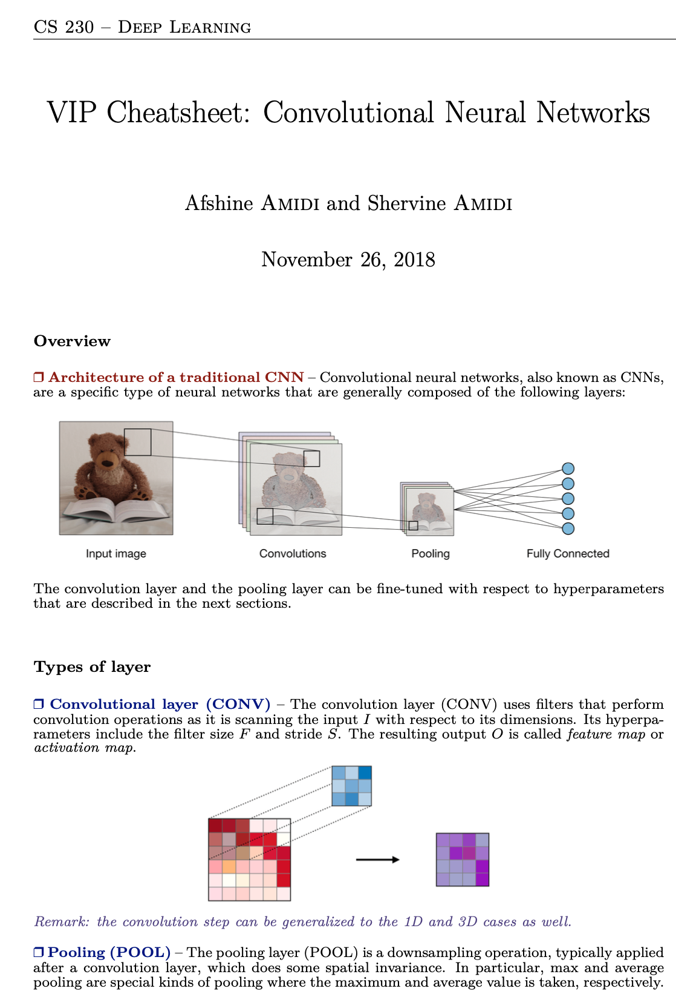
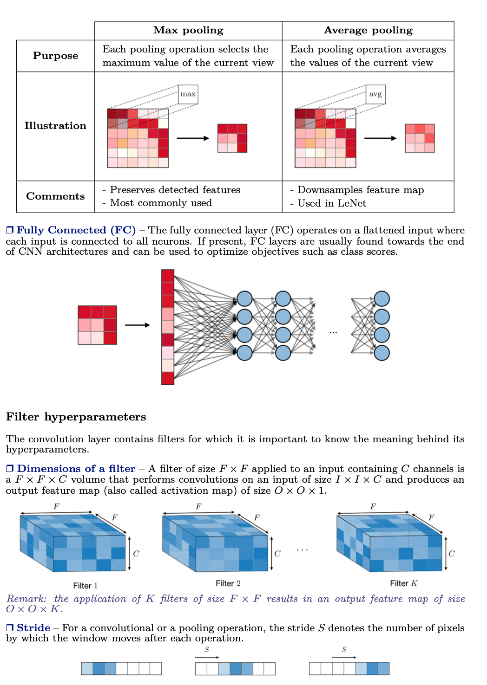
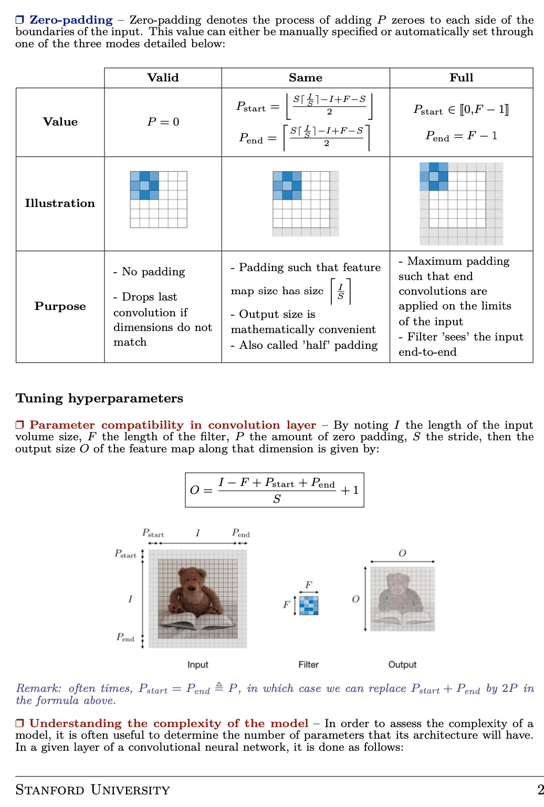
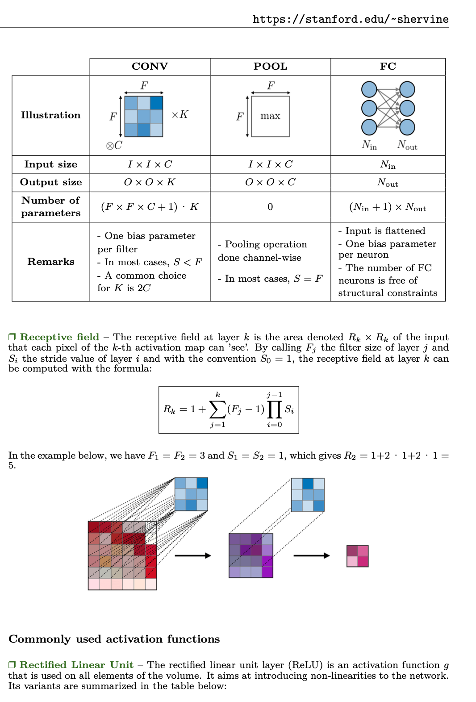

## Convolutional Neural Networks Cheatsheet

🔺 Let's get to know the CNN networks that we frequently use in deep learning with these cheatsheets today.

A view from the project: 
A view from the project: 
A view from the project: 
A view from the project: 
